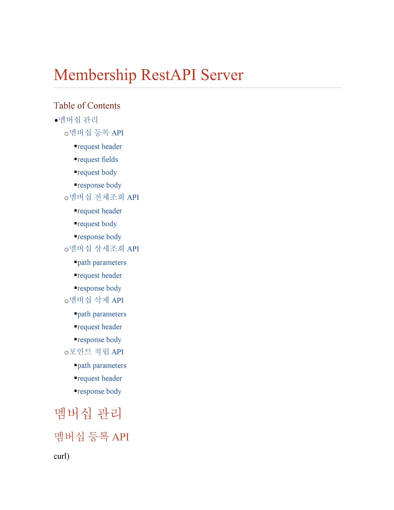
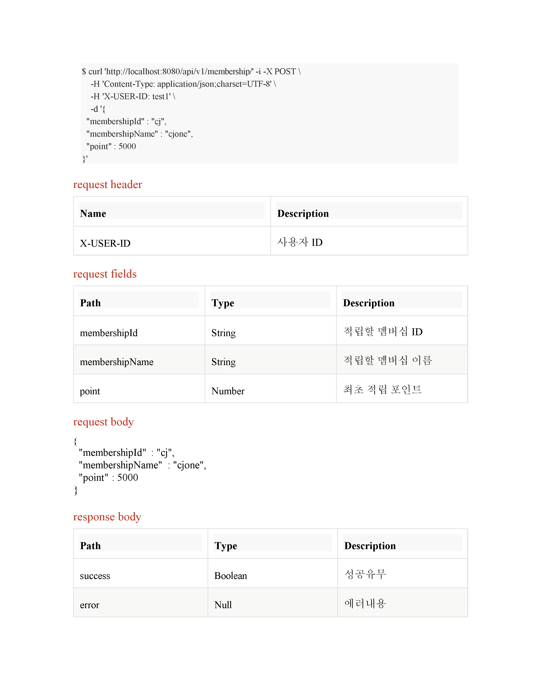
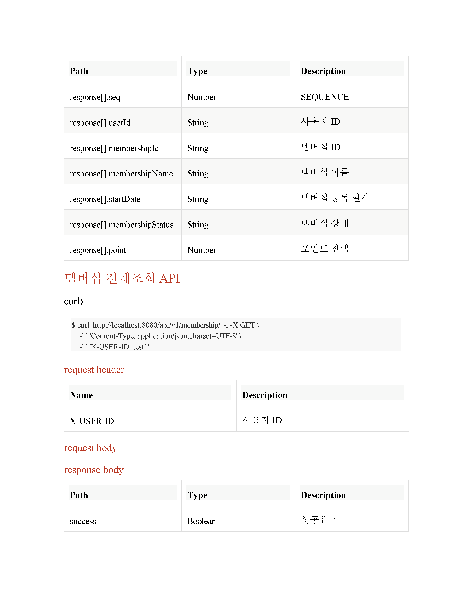
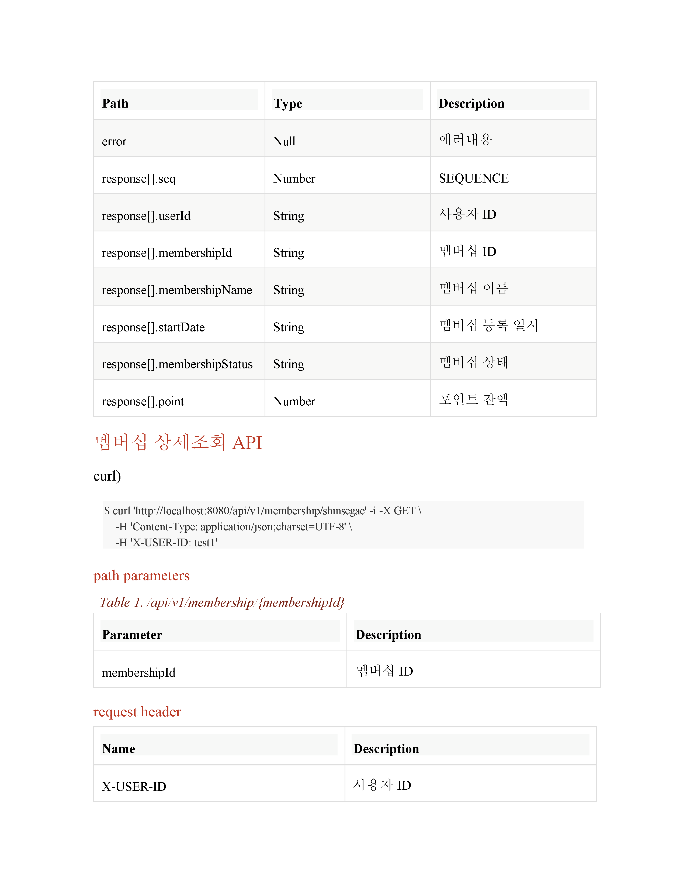
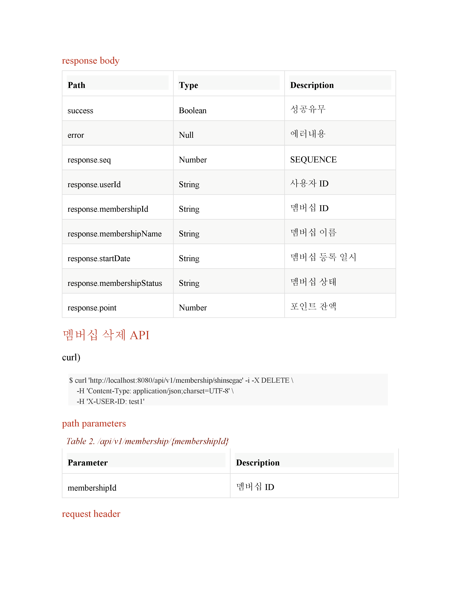
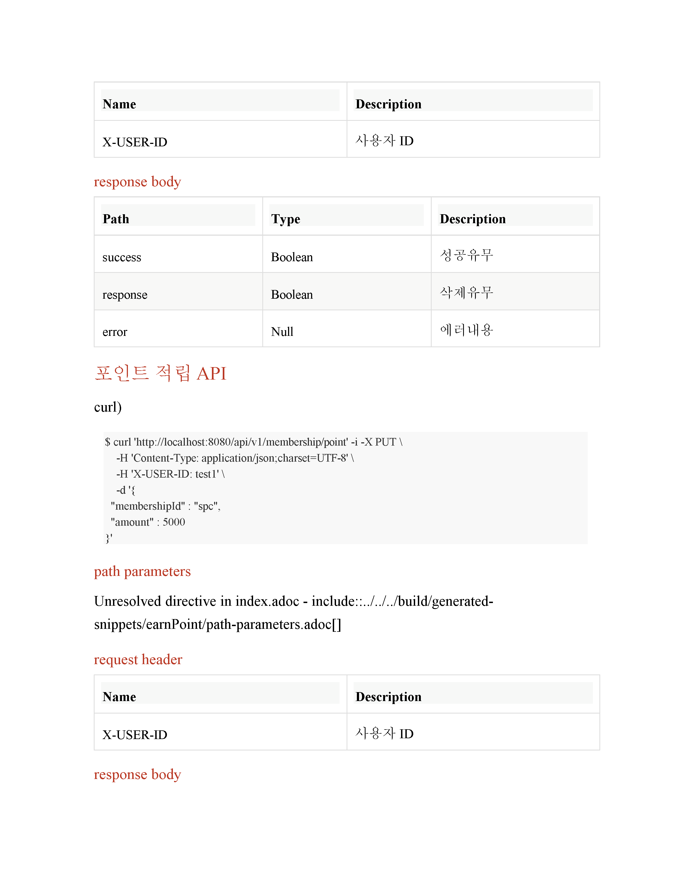
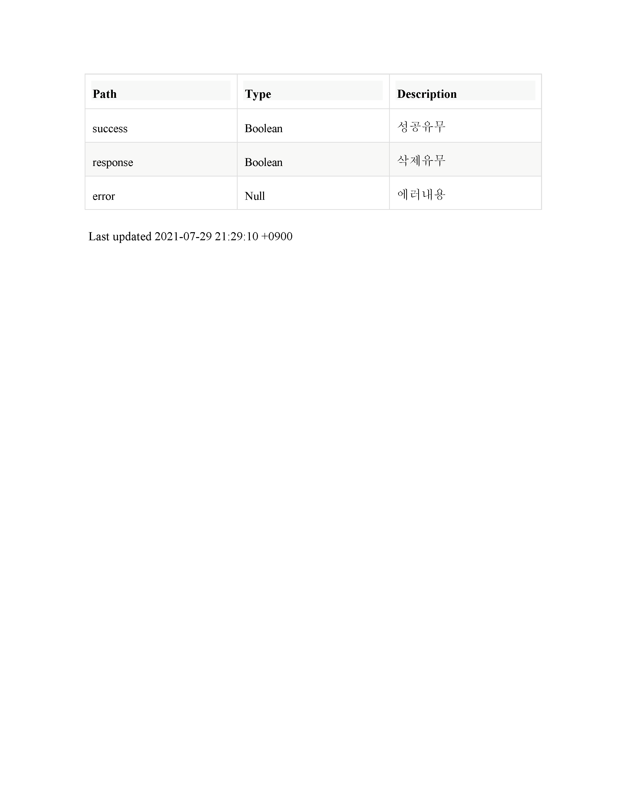

# 멤버십 적립 서비스 API

## Feature
* Java 8
* Sprint boot 2.5.2
* JPA, h2
* gradle 6.6.1
* Spring Rest Docs

## 프로젝트 소개
유저의 멤버십을 적립하기 위한 API

### 기능
1. 멤버십 등록
2. 멤버십 전체조회
3. 멤버십 상세조회
4. 멤버십 삭제
5. 포인트 적립
6. API들에 대한 Documnet 제공(Spring Rest Docs)

## Getting Started
* build
```cmd
./gradlew clean bootJar
```
* run(default port:5000)
```cmd
java -jar build/libs/mbs-0.0.1-SNAPSHOT.jar
```

## API Document
```cmd
http://localhost:8081/docs/index.html
```

## 문제 해결 전략 
### 1. 멤버십등록
```
멤버십등록 절차
  1. 멤버십을 등록하기 위해 유저가 있는지 조회(없으면 생성)
  2. 해당 멤버십 상세정보가 존재하는지 조회(없으면 생성)
  3. 해당 멤버십 상세정보를 출력

발생가능한 예외 : 
  1: 동일한 멤버십이 이미 존재합니다.
  2: 멤버십ID와 멤버십이름 불일치하지 않습니다.
  3: 해당 멤버십은 존재하지 않습니다.
  4: parameter type(ex. 포인트는 문자열X)
```
### 2. 멤버십 전체조회
```
멤버십전체조회 절차
  1. 해당 유저가 존재하는지 확인
  2. 해당 유저의 전체 멤버십 상세데이터 출력

발생가능한 예외 : 
  1: 해당 유저가 없습니다.
  2: parameter type
```
### 3. 멤버십 상세조회
```
멤버십상세조회 절차
  1. 해당 유저가 존재하는지 확인
  2. 해당 유저의 개별 멤버십 상세데이터가 존재하는지 확인
  3. 해당 유저의 개별 멤버십 상세데이터 출력

발생가능한 예외 : 
  1: 상세조회할 멤버십 데이터가 없습니다.
  2: 해당 유저가 없습니다.
  3: parameter type
```
### 4. 멤버십 삭제
```
멤버십삭제 절차
  1. 해당 유저가 존재하는지 확인
  2. 해당 유저의 멤버십 상태가 활성화상태인지 조회
  3. 해당 유저의 멤버십 상태가 활성화 상태이면 비활성화로 변경

발생가능한 예외 : 
  1: 삭제할 멤버십이 없습니다.
  2: 해당 유저가 없습니다.
  3: parameter type
```
### 5. 포인트 적립
```
포인트적립 절차
  1. 해당 유저가 존재하는지 확인
  2. 해당 유저의 멤버십 상태가 활성화상태인지 조회
  3. 해당 유저의 멤버십 상태가 활성화 상태이면 포인트 적립

발생가능한 예외 : 
  1: 적립할 멤버십이 존재하지 않습니다.
  2: 해당 유저가 없습니다.
  3: 조회된 멤버십의 상태가 비활성화 상태입니다.
  4: parameter type
```

<br><br>

## API 명세서







